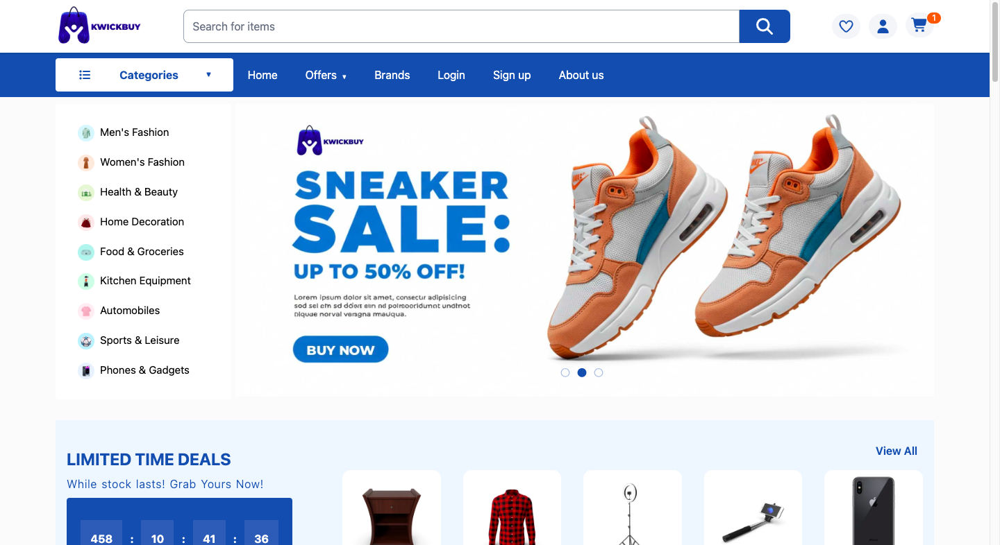
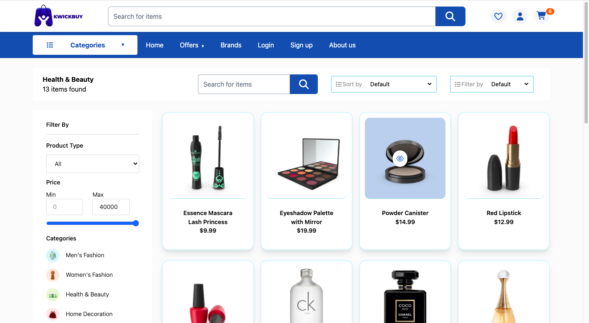

# 🛒 Kwickbuy — E‑Commerce Store

A minimal but realistic e‑commerce frontend built with React. Browse products, add to cart, complete a checkout flow (shipping → payment → confirmation), and experience realistic UI/UX patterns used in production apps.

## Table of contents

- [Overview](#overview)
- [Features](#features)
- [Tech Stack](#tech-stack)
- [Why this project](#why-this-project)
- [Implementation notes](#implementation-notes)
- [Future improvements](#future-improvements)
- [How to run (local)](#how-to-run)

## Overview

### About

Kwickbuy is a React-based frontend that simulates a real shopping experience. It consumes product data from the DummyJSON API and demonstrates non-trivial frontend features such as cart management, quantity handling, protected checkout flow (frontend-guarded), and a mock payment flow supporting Cash on Delivery and Stripe (mock).

This project is intended for portfolio/demo purposes and focuses on showing clean frontend architecture, state management patterns, and UX considerations rather than being a full production backend service.

### 📸 Screenshot




### Links

- Live Demo : [Demo](https://kwickbuy.netlify.app/)

## ✨ Features

- Product listing & product detail pages (from DummyJSON API)
- Add to cart, update quantity, remove item, buy now
- Cart persisted in localStorage (survives page reload)
- Checkout flow: Shipping → Payment → Order Complete
- Payment methods: Cash on Delivery (instant) and Stripe (mocked flow)
- Route guards using lightweight localStorage flags to prevent bypassing steps
- Responsive layout for mobile & desktop
- Brand page with curated brand logos (polished presentation)

## 🛠 Tech stack

- Frontend: React (Vite)

- Routing: React Router

- Styling: Tailwind CSS

- State management: useReducer for cart logic (local state); localStorage for persistence of checkout flags

- API: DummyJSON (products)

- Hosting: Netlify

## 📌 Why this project

This project was built to demonstrate:

- End-to-end app design (from product listing to checkout)

- Real-world React patterns (context, reducers, protected routes, local storage)

- Frontend fundamentals (state management, routing, form validation, responsive UI)

It’s not just a UI, it simulates a real shopping experience that could be extended into production with minimal backend setup.

## 🏗️ Implementation notes

- **Curated brands**: Some API brands from DummyJSON are unrealistic or inconsistent, so I curated a clean set of real brands with logos for the Brands page. This improves presentation and UX while still demonstrating how to map API data to UI assets.

- **Cart & quantities**: Cart is an array stored in useReducer and persisted to localStorage. On ADD_TO_CART, the reducer increases quantity if the product already exists instead of pushing duplicates.

- **Route guards (frontend)**: To prevent users from typing /payment or /payment-success directly, the checkout flow sets lightweight flags in localStorage (shippingComplete, paymentAuthorized). Pages read these flags on mount (state-initializer pattern) and redirect if the required flag isn't set. Flags are cleared after reading on the success page.

## 📚 Future improvements

- Real Stripe integration
- User authentication (login + guest checkout)
- Wishlist & Order history pages

## 📦 How to run

1. Clone the repository:

   ```sh
   git clone https://github.com/Jacbfrancis/Kwickbuy-e-commerce-store.git

   ```

2. Navigate to the project folder:

   ```sh
   cd Kwickbuy-e-commerce-store

   ```

3. Install dependencies:

   ```sh
   npm install

   ```

4. Start the development server:

   ```sh
   npm run dev

   ```
